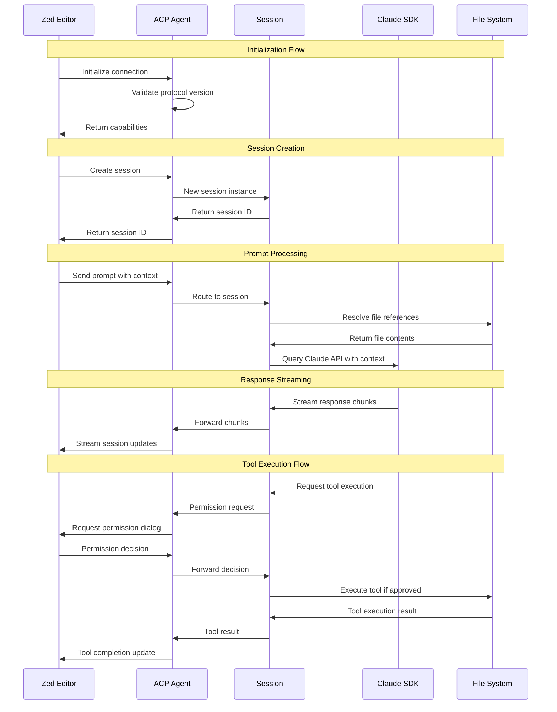

# Architecture Overview

## System Components

The Claude Code ACP Agent is built using a layered architecture that separates concerns and ensures maintainable, extensible code.

### Core Layers

#### 1. Protocol Layer (`src/protocol/`)
- **Connection Management** (`connection.ts`): Handles JSON-RPC communication with Zed Editor
- **Schema Validation** (`schemas.ts`): Zod-based validation for all ACP message types
- **Bidirectional Streaming**: Real-time communication for tool execution and responses

#### 2. Bridge Layer (`src/bridge/`)
- **ACP Agent** (`agent.ts`): Main agent implementation handling protocol lifecycle
- **Session Management** (`session.ts`): Multi-session support with automatic cleanup
- **Permission System** (`permissions.ts`): Fine-grained security and user consent

#### 3. File Intelligence (`src/files/`)
- **Smart File Resolution** (`resolver.ts`): Intelligent file path resolution with fallbacks
- **ACP Filesystem Proxy** (`filesystem.ts`): Safe filesystem access with ACP integration
- **Gitignore Awareness**: Respects project gitignore rules for file filtering

#### 4. Utility Layer (`src/utils/`)
- **Type Definitions** (`types.ts`): Comprehensive TypeScript interfaces
- **Error Handling** (`errors.ts`): Structured error management with ACP error codes

## Data Flow



## Protocol Specifications

### ACP Message Types

#### Core Protocol Messages
- **Initialize**: Protocol version negotiation and capability discovery
- **NewSession**: Create new conversation session with working directory
- **LoadSession**: Resume existing session (optional)
- **Prompt**: Send user prompt with embedded context and file references
- **Cancel**: Abort current operation gracefully

#### Session Management
- **SessionUpdate**: Stream responses, tool calls, and status updates
- **RequestPermission**: Interactive permission requests for tool execution
- **ReadTextFile**: Safe file reading through ACP protocol
- **WriteTextFile**: Safe file writing through ACP protocol

#### Authentication
- **Authenticate**: Handle API key validation and auth method selection

### Protocol Flow States

```
Uninitialized → Initialize → Ready
                               ↓
                          NewSession → SessionActive
                               ↓              ↓
                          LoadSession → Prompt → Response
                               ↓              ↓
                           Cancel ← ← ← ← ← Cancel
```

## Component Architecture

### ClaudeACPAgent
Main orchestrator class that:
- Implements the ACP protocol interface
- Manages multiple concurrent sessions
- Coordinates between protocol layer and business logic
- Handles authentication and initialization

```typescript
class ClaudeACPAgent implements ACPClient {
  private connection: Connection;
  private sessionManager: SessionManager;
  private permissionManager: PermissionManager;
  private diskFileSystem: FileSystemService;
}
```

### SessionManager
Handles session lifecycle:
- Creates and destroys sessions
- Enforces session limits and timeouts
- Provides session cleanup and resource management
- Maintains session state and metadata

### Session
Individual conversation context:
- Maintains conversation history
- Handles Claude SDK integration
- Manages file resolution context
- Provides cancellation support

### FileResolver
Intelligent file path resolution:
- Direct path resolution
- Glob pattern fallback for fuzzy matching
- Gitignore filtering
- Project boundary enforcement

## Security Architecture

### Permission Model
The agent implements a multi-level permission system:

1. **Default Permissions**: Safe operations (read-only) allowed by default
2. **User Consent**: Interactive prompts for potentially dangerous operations
3. **Capability Restrictions**: Tools can be disabled via configuration
4. **Filesystem Boundaries**: Operations restricted to project directory

### File System Security
- All file operations go through ACPFileSystem proxy
- Path traversal protection
- Gitignore respect for privacy
- Read-only mode available for sensitive environments

## Extension Points

The architecture supports several extension mechanisms:

### Custom Tool Implementations
Implement the ToolCall interface for new capabilities:
```typescript
interface ToolCall {
  id: string;
  name: string;
  type: 'file_edit' | 'execute' | 'read' | 'search' | 'other';
  description: string;
  parameters: Record<string, unknown>;
}
```

### Custom File Systems
Implement FileSystemService for alternative storage:
```typescript
interface FileSystemService {
  readFile(path: string): Promise<string>;
  writeFile(path: string, content: string): Promise<void>;
  stat(path: string): Promise<Stats>;
  exists(path: string): Promise<boolean>;
}
```

### Custom Permission Strategies
Extend PermissionManager for custom security policies:
```typescript
class CustomPermissionManager extends PermissionManager {
  async checkPermission(tool: ToolCall, client: ACPClient, sessionId: string): Promise<PermissionDecision> {
    // Custom permission logic
  }
}
```

## Performance Considerations

### Memory Management
- Sessions automatically cleaned up after timeout
- Configurable session limits prevent memory leaks
- File content streaming for large files
- Efficient glob operations with fast-glob

### Concurrency
- Multiple sessions supported concurrently
- Non-blocking I/O throughout the stack
- Proper cancellation support with AbortController
- Resource cleanup on process termination

### Caching Strategy
- File resolution results cached per session
- Gitignore parsing cached per project
- Session metadata kept minimal for efficiency

## Error Handling

### Error Categories
1. **Protocol Errors**: Invalid ACP messages or protocol violations
2. **Authentication Errors**: Missing or invalid API credentials
3. **File System Errors**: Path resolution or access issues
4. **Claude API Errors**: Upstream API failures or rate limits
5. **Session Errors**: Session not found or expired

### Error Recovery
- Graceful degradation when features are unavailable
- Automatic retry for transient failures
- Clear error messages for user action
- Debug mode for detailed error investigation

## Configuration Management

### Configuration Sources
1. Environment variables (highest priority)
2. Command-line arguments
3. Configuration file (`--config`)
4. Built-in defaults (lowest priority)

### Configuration Schema
```typescript
interface Config {
  cwd: string;                    // Working directory
  enableSmartSearch: boolean;     // Enable glob fallback
  respectGitignore: boolean;      // Filter by gitignore
  debug: boolean;                 // Debug logging
  maxConcurrentSessions: number;  // Session limit
  sessionTimeoutMs: number;       // Session timeout
}
```

## Dependencies

### Core Dependencies
- `@anthropic-ai/claude-code`: Official Claude SDK for AI capabilities
- `@zed-industries/agent-client-protocol`: ACP protocol implementation
- `fast-glob`: High-performance glob matching
- `ignore`: Gitignore parsing and filtering
- `zod`: Runtime type validation

### Development Dependencies
- `typescript`: Type checking and compilation
- `esbuild`: Fast bundling and building
- `jest`: Testing framework
- `ts-jest`: TypeScript integration for Jest

## Deployment Considerations

### Distribution
- NPM package with binary entry point
- Single executable bundle via esbuild
- Cross-platform Node.js compatibility
- Minimal runtime dependencies

### Environment Requirements
- Node.js 18+ for modern JavaScript features
- Zed Editor 0.162.0+ for ACP v2 support
- Valid Anthropic API key
- Network access for Claude API calls

### Monitoring
- Structured logging with configurable levels
- Session metrics and timeout tracking
- Error reporting with context
- Debug mode for troubleshooting

## Testing Strategy

### Unit Tests
- Protocol message validation
- File resolution logic
- Permission system behavior
- Error handling scenarios

### Integration Tests
- End-to-end ACP protocol communication
- Claude SDK integration
- File system operations
- Session lifecycle management

### Manual Testing
- Zed Editor integration testing
- Performance under load
- Error recovery scenarios
- User experience validation

## Future Enhancements

### Planned Features
- Multi-model support (GPT, Gemini integration)
- Advanced caching mechanisms
- Plugin architecture for custom tools
- Enhanced security policies

### Extension Opportunities
- Language Server Protocol (LSP) integration
- Code intelligence features
- Project-aware context enhancement
- Collaborative editing support